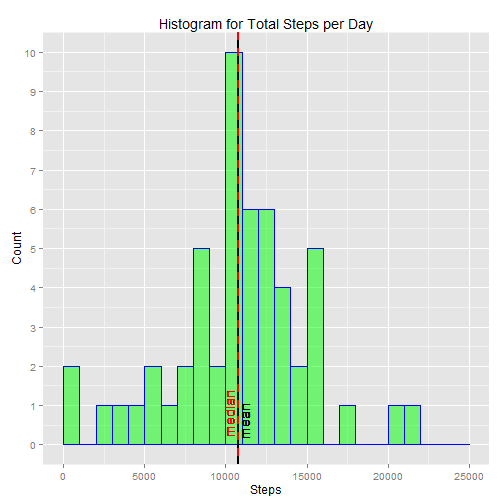
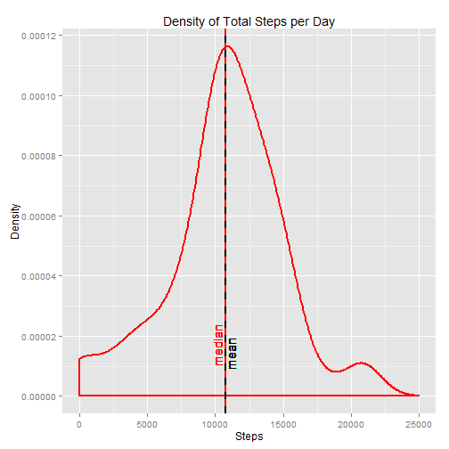
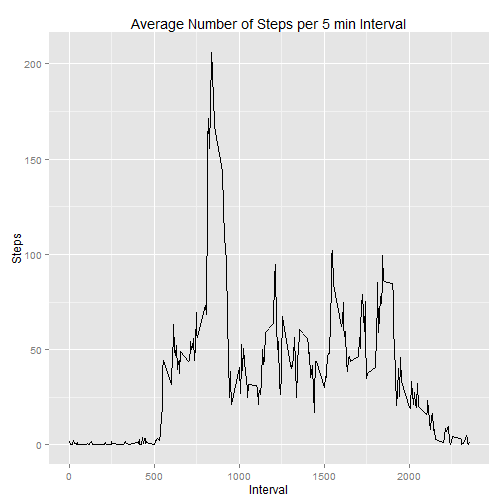
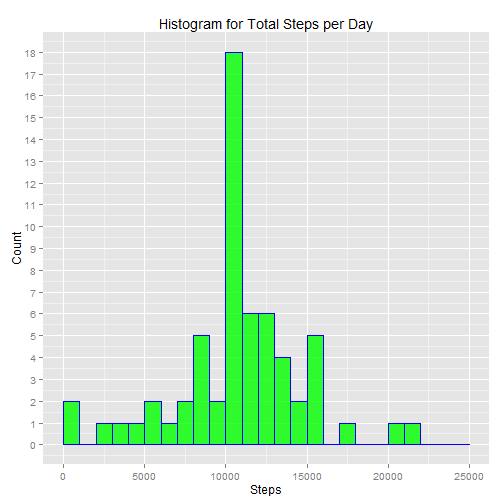
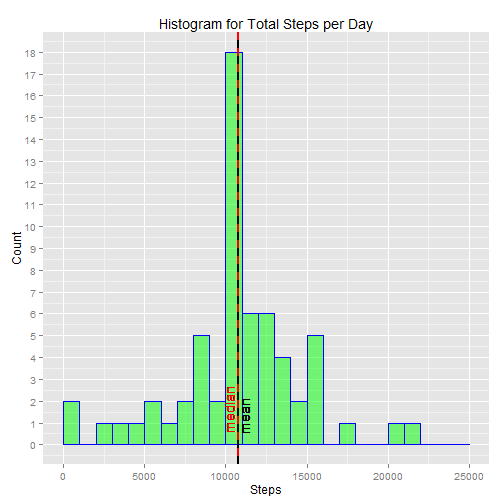
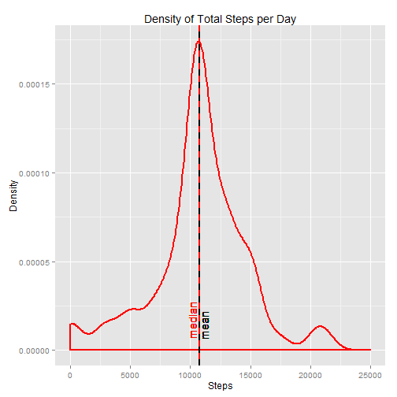
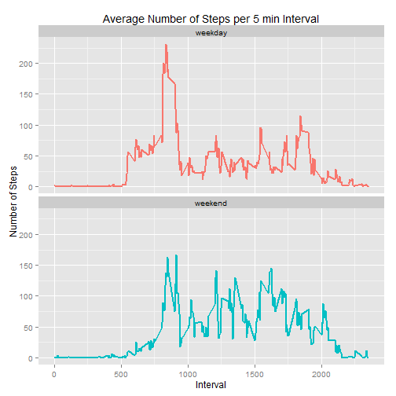

## Introduction

This assignment makes use of data from a personal activity monitoring
device. This device collects data at 5 minute intervals through out the
day. The data consists of two months of data from an anonymous
individual collected during the months of October and November, 2012
and include the number of steps taken in 5 minute intervals each day.

## Data

The data for this assignment can be downloaded from the course web
site:

* Dataset: [Activity monitoring data](https://d396qusza40orc.cloudfront.net/repdata%2Fdata%2Factivity.zip) [52K]

The variables included in this dataset are:

* **steps**: Number of steps taking in a 5-minute interval (missing
    values are coded as **_NA_**)

* **date**: The date on which the measurement was taken in YYYY-MM-DD
    format

* **interval**: Identifier for the 5-minute interval in which
    measurement was taken


The dataset is stored in a comma-separated-value (CSV) file and there
are a total of 17,568 observations in this
dataset.

## Loading and preprocessing the data

  * Set the locale to "English" and load required libraries

```r
Sys.setlocale("LC_TIME", "English")
```

```
## [1] "English_United States.1252"
```

```r
suppressMessages(library(ggplot2))
suppressMessages(library(dplyr))
```
This is required for me to make it univerally applicable, since I am on a non-US/non-English locale normally.

  * Load the data (i.e. *read.csv()*)

```r
raw_data <- read.csv(unzip("./activity.zip"), header = TRUE, sep = ",")
```
Which results in a dataframe of 17568 objects with 3 variables/observations,
namely: steps, date and interval.

  * Process/transform the data (if necessary) into a format suitable for your analysis  
The dates are made into dates instead of Factors and the intervals will be transformed to Factors:

```r
clean_data <- raw_data
clean_data$date <- as.Date(clean_data$date, format = "%Y-%m-%d")
```

This will make it easier to use in further analyses later on.

## What is mean total number of steps taken per day?

To answer this question I will first plot a histogram of total steps per day.
In order to be able to plot the histogram I aggregate all the steps taken on a day. 
The **_NA_** values are ignored and aggregation will be done by normal summing over steps for a day.
Then the plot will be created and drawn.


```r
total_steps_day <- aggregate(steps ~ date, data = clean_data, sum, na.rm = TRUE)
g1 <- ggplot(total_steps_day, aes(x = steps)) + 
    geom_histogram(colour = "blue", fill = "green", alpha = 0.8, binwidth = 1000) + 
    labs(title = "Histogram for Total Steps per Day") + labs(x = "Steps", y = "Count") + 
    xlim(c(0,25000)) + scale_y_continuous(breaks = seq(0,10,1))
plot(g1)
```

 

Next the mean and median of total number of steps taken per day is calculated.
For this the variable **steps** of the dataframe **total_steps_day** will be used as created above.
And the resulting **mean** and **median** will also be plotted into the histogram for good measure.


```r
mean <- mean(total_steps_day$steps)
cat("Mean number of steps taken per day =" ,mean)
```

```
## Mean number of steps taken per day = 10766.19
```

```r
median <- median(total_steps_day$steps)
cat("Median number of steps taken per day =" ,median)
```

```
## Median number of steps taken per day = 10765
```

```r
g1 <- ggplot(total_steps_day, aes(x = steps)) + 
    geom_histogram(colour = "blue", fill = "green", alpha = 0.5, binwidth = 1000) + 
    labs(title = "Histogram for Total Steps per Day") + labs(x = "Steps", y = "Count") +
    xlim(c(0,25000)) + scale_y_continuous(breaks = seq(0,10,1)) + 
    geom_vline(xintercept = median, size = 1, linetype = 1, col = "red") + 
    geom_vline(xintercept = mean, size = 1, linetype = "dashed") +
    geom_text(aes(x=mean, label="mean", y = 0.6), colour="black", angle=90,
              text=element_text(size=9), vjust = 1) +
    geom_text(aes(x=mean, label="median", y = 0.8), colour="red", angle=90, 
              text=element_text(size=9), vjust = -0.4)
plot(g1)
```

 

```r
g2 <- ggplot(total_steps_day, aes(x = steps, y = ..density..)) + 
    labs(title = "Density of Total Steps per Day") + labs(x = "Steps", y = "Density") +
    xlim(c(0,25000)) + scale_y_continuous(breaks = seq(0,0.0002,0.00002)) +
    geom_density(col = 2, size = 1) + geom_vline(xintercept = median, size = 1,
                                                 linetype = 1, col = "red") + 
    geom_vline(xintercept = mean, size = 1, linetype = "dashed") +
    geom_text(aes(x=mean, label="mean", y = 0.000014), colour="black", angle=90,
              text=element_text(size=6), vjust = 1) + 
    geom_text(aes(x=mean, label="median", y = 0.000017), colour="red", angle=90,
              text=element_text(size=6), vjust = -0.4)                                                       
plot(g2)
```

 


## What is the average daily activity pattern?

To answer the question about the average daily activity pattern, we will first take a look at a time series plot of the 5-minute interval and the average number of steps taken, which will be averaged across all the days.


```r
average_steps_interval <- aggregate(steps ~ interval, data = clean_data, FUN="mean", na.rm = TRUE)
g3 <- ggplot(average_steps_interval, aes(x = interval, y = steps)) + geom_line() + 
    labs(title = "Average Number of Steps per 5 min Interval") + labs(x = "Interval", y = "Steps")
plot(g3)
```

 

There is a clear peak somewhere between the intervals **_750_** and **_1000_** and some smaller peaks after that.
So what exactly is the interval with the maximum number of steps when averaging across all the days in the dataset?


```r
max_steps_interval <- average_steps_interval %>% filter(steps == max(steps)) 
cat("The interval with (on average over all days) the highest number of steps taken per day is" 
    ,max_steps_interval$interval)
```

```
## The interval with (on average over all days) the highest number of steps taken per day is 835
```

```r
cat("This interval has an average of",max_steps_interval$steps, "steps taken.")
```

```
## This interval has an average of 206.1698 steps taken.
```

It turns out that the interval with the maximum number of steps is the 5-minute interval of **_835_** till **_840_** with **_206.1698_** steps on average.

## Imputing missing values

Do the missing values have impact on the mean and median of the total number of steps taken per day?
The answer to this question will be given in this section.
We will be starting by calculating the amount of missing values in the dataset.


```r
na_steps <- sum(is.na(clean_data$steps))
cat("The number of missing values in the dataset is:",na_steps)
```

```
## The number of missing values in the dataset is: 2304
```

The plan is to impute the missing values by taking the mean values for the 5-minute intervals and replacing the **_NA_**'s.
These mean values have already been stored in **average_steps_interval**. So for the rows with **_NA_** values,
the interval will be used to look up the corresponding average steps taken for that interval in that data_frame and be replaced by that number.


```r
no_missing_data <- clean_data
no_missing_data$steps <- sapply(1:length(no_missing_data[,1]), function(x, y, z) {
    if(is.na(y$steps)[x]){
         y$steps[x] = z[z$interval == y$interval[x],2]
         }
    else 
        y$steps[x] = y$steps[x]
    }, y=no_missing_data, z=average_steps_interval)

no_na_steps <- sum(is.na(no_missing_data$steps))
cat("The number of missing values in the new dataset is:",no_na_steps)
```

```
## The number of missing values in the new dataset is: 0
```

Next step is plotting the histogram of total steps per day again, but then with the imputed values included:


```r
total_steps_day2 <- aggregate(steps ~ date, data = no_missing_data, sum, na.rm = TRUE)
g4 <- ggplot(total_steps_day2, aes(x = steps)) + 
    geom_histogram(colour = "blue", fill = "green", alpha = 0.8, binwidth = 1000) + 
    labs(title = "Histogram for Total Steps per Day") + labs(x = "Steps", y = "Count") + 
    xlim(c(0,25000)) + scale_y_continuous(breaks = seq(0,20,1)) 
plot(g4)
```

 

It seems that the **mean** and **median** should be around the same value. Only the count of the bin of **_10000-11000_** seems to have changed. So let's see what the values of the mean and median are now:


```r
mean2 <- mean(total_steps_day2$steps)
cat("Mean number of steps taken per day =" ,mean2)
```

```
## Mean number of steps taken per day = 10766.19
```

```r
median2 <- median(total_steps_day2$steps)
cat("Median number of steps taken per day =" ,median2)
```

```
## Median number of steps taken per day = 10766.19
```

Our suspicion is partially confirmed. The mean has not changed by imputing the missing values.
The median, however, has changed to be equal to the mean.
The two plots below show this in a visual way. Thus by using the strategy of taking the mean value for a 5-minute interval where the value is missing, the mean doesn't change and the median changed to be equal to the mean value.


```r
g5 <- ggplot(total_steps_day2, aes(x = steps)) + 
    geom_histogram(colour = "blue", fill = "green", alpha = 0.5, binwidth = 1000) +
    labs(title = "Histogram for Total Steps per Day") + labs(x = "Steps", y = "Count") +
    xlim(c(0,25000)) + scale_y_continuous(breaks = seq(0,20,1)) + 
    geom_vline(xintercept = median, size = 1, linetype = 1, col = "red") + 
    geom_vline(xintercept = mean, size = 1, linetype = "dashed") +
    geom_text(aes(x=mean, label="mean", y = 1.3), colour="black", angle=90,
              text=element_text(size=9), vjust = 1) +
    geom_text(aes(x=mean, label="median", y = 1.6), colour="red", angle=90,
              text=element_text(size=9), vjust = -0.4)
plot(g5)
```

 

```r
g6 <- ggplot(total_steps_day2, aes(x = steps, y = ..density..)) + 
    labs(title = "Density of Total Steps per Day") + labs(x = "Steps", y = "Density") +
    xlim(c(0,25000)) + scale_y_continuous(breaks = seq(0,0.0002,0.00005)) +
    geom_density(col = 2, size = 1) + geom_vline(xintercept = median, size = 1,
                                                 linetype = 1, col = "red") + 
    geom_vline(xintercept = mean, size = 1, linetype = "dashed") +
    geom_text(aes(x=mean, label="mean", y = 0.000014), colour="black", angle=90,
              text=element_text(size=6), vjust = 1) + 
    geom_text(aes(x=mean, label="median", y = 0.000017), colour="red", angle=90,
              text=element_text(size=6), vjust = -0.4)                                                       
plot(g6)
```

 


## Are there differences in activity patterns between weekdays and weekends?

As a start we will introduce a new variable called **day**, which will be a Factor with 2 levels: **_"weekend"_** and **_"weekday"_**: 


```r
no_missing_data$day <- sapply(1:length(no_missing_data[,1]), function(x, y) {
    if(weekdays(y$date[x]) %in% c("Saturday","Sunday")) 
        "weekend"
    else 
        "weekday"
    }, y=no_missing_data)
no_missing_data$day <- as.factor(no_missing_data$day)
```

Now that the dataset without **_NA_** values has a variable to distinguish between weekdays and weekends, it is time to plot a time-series plot. The plot will be using a grouping on the **day** variable. I choose to plot the two facets in rows, so that it is easy to compare the weekdays with the weekends. Plus I prefer the labels on top of the facets in stead of on the side:


```r
average_steps_interval2 <- aggregate(steps ~ interval + day, data = no_missing_data, FUN="mean")
g7 <- ggplot(average_steps_interval2, aes(x = interval, y = steps, group = day, color = day)) + 
    facet_wrap(~ day, nrow = 2) + geom_line(lwd=1) + 
    labs(title = "Average Number of Steps per 5 min Interval") + 
    labs(x = "Interval", y = "Number of Steps") + guides(colour = FALSE)
plot(g7)
```

 

The plot shows some very clear differences in activity patterns. The morning peak on the weekdays is way higher than at the same time in the weekends, but contrastingly the activity during the rest of the day is much higher on weekends.
It is also clear that the activity in the weekends continue till later on the day than during the weekdays, which is what you would expect normally.

